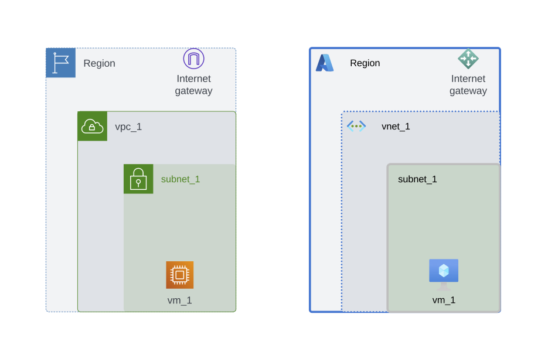

# IaC-overview

My goal is to describe the different possibilities of Terraform using two simple examples. The focus is to understand how to abstract the parameters from a flat structure, where all parameters are hard coded, to finally achieve a scalable modular design. 

This is the simple infrastructure example used each subdirectory:

### AWS:
* 1x VPC
* 1x Internet Gateway
* 1x Subnet
* 1x Virtual Machine

### Azure:
* 1x VNet
* 1x Internet Gateway
* 1x Subnet
* 1x Virtual Machine

### Folder: 1-TF-simple-flat-structure

This is the simplest and probably the first coding attempt of someone starting with IaC. Here the parameters are defined in code and each resource individually.

### Folder: 2-TF-simple-flat-structure-with-variables

Here the parameters have already been moved to a seperate file, but a flat structure is still used where the resources are created individually.

### Folder: 3-TF-custom-modules

Now the flat structure has been modularized and you can call the modules in a scalable way.

### Folder: 4-TF-standard-modules

Alternatively, you can use standard modules available in [Terraform Registry](https://registry.terraform.io/browse/modules). In this simple example it was possible without problems, but most of the time a combination of custom and standard modules is needed.

## Install Terraform CDK

https://developer.hashicorp.com/terraform/tutorials/cdktf/cdktf-install
sudo npm install --global cdktf-cli@latest
sudo npm install -g npm@9.1.1
cdktf init --template=typescript --local
npm install @cdktf/provider-aws
npm install @cdktf/provider-azurerm

